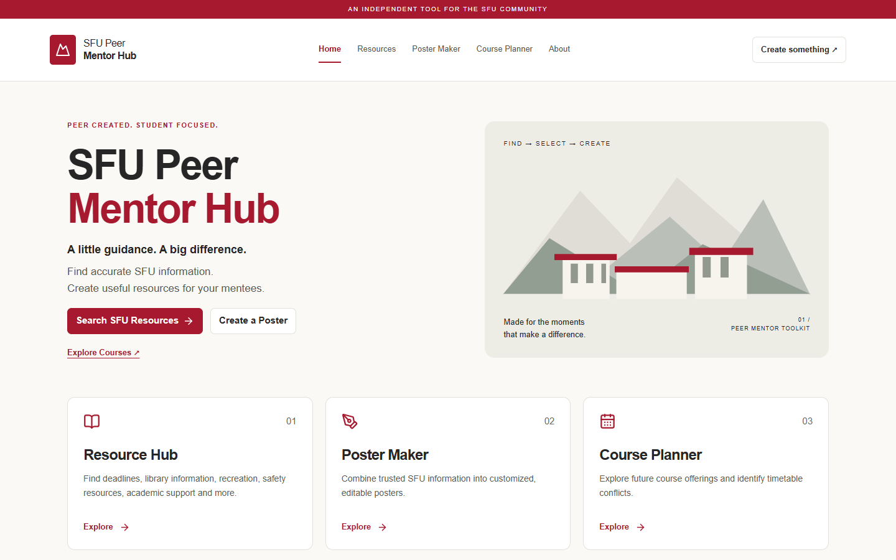
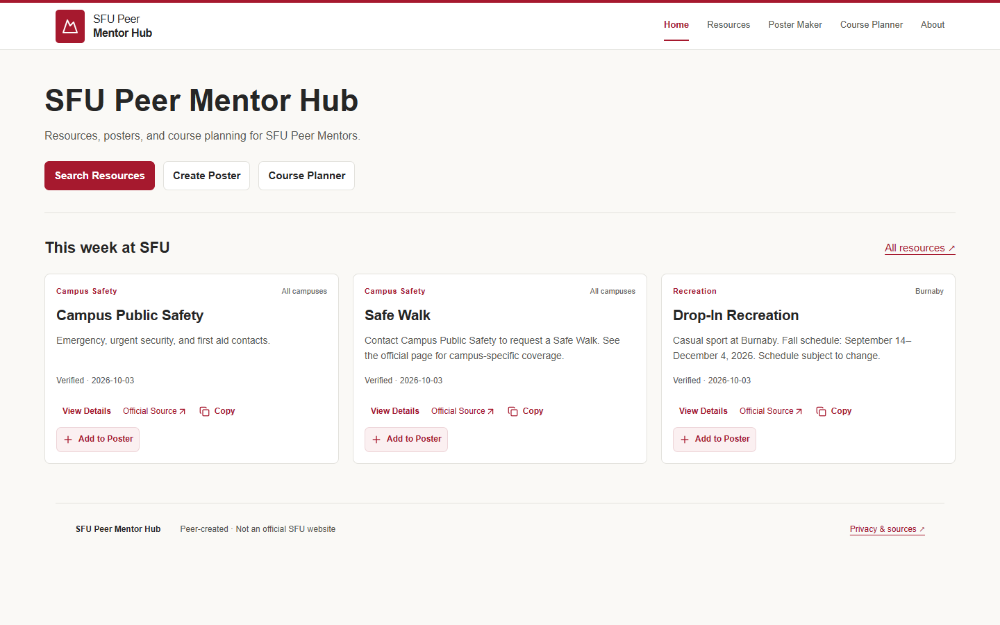
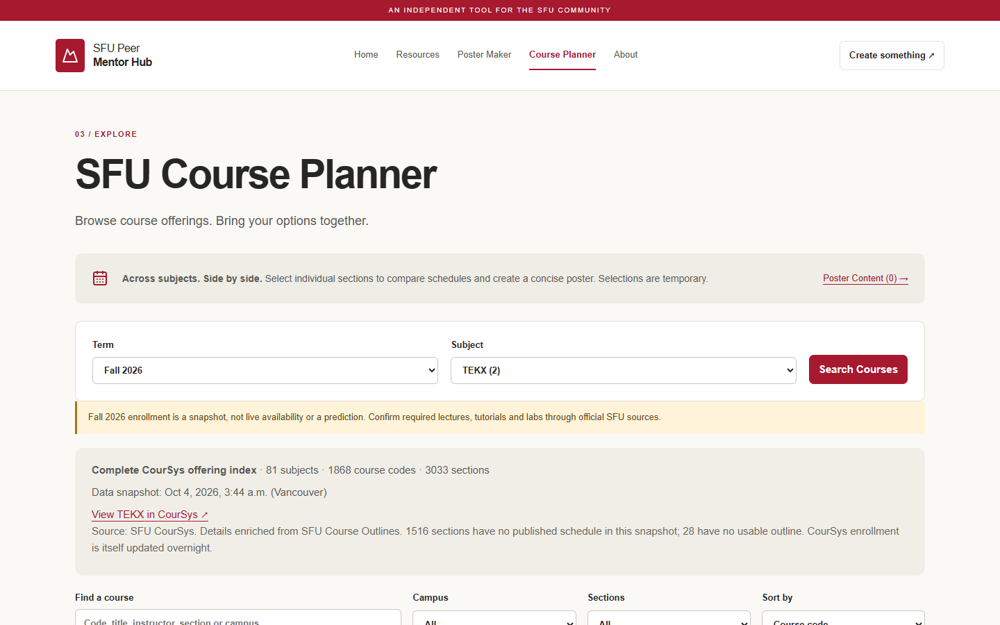
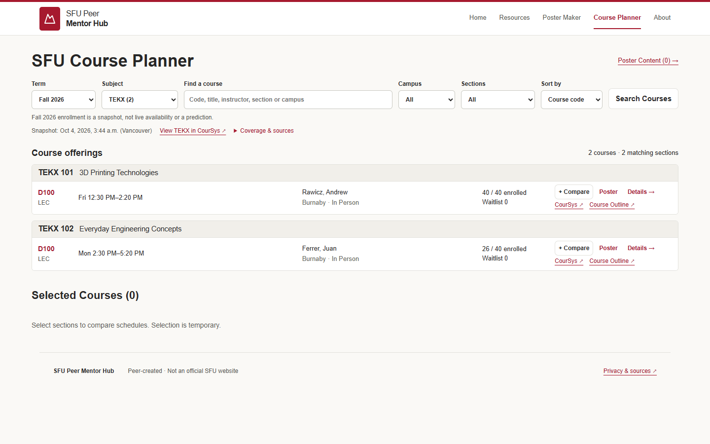
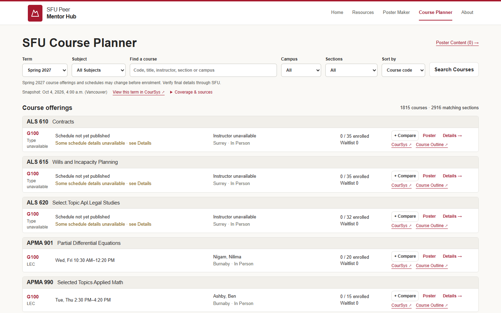
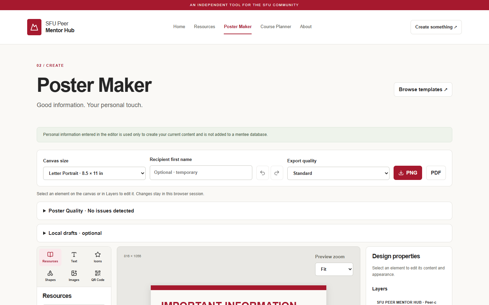
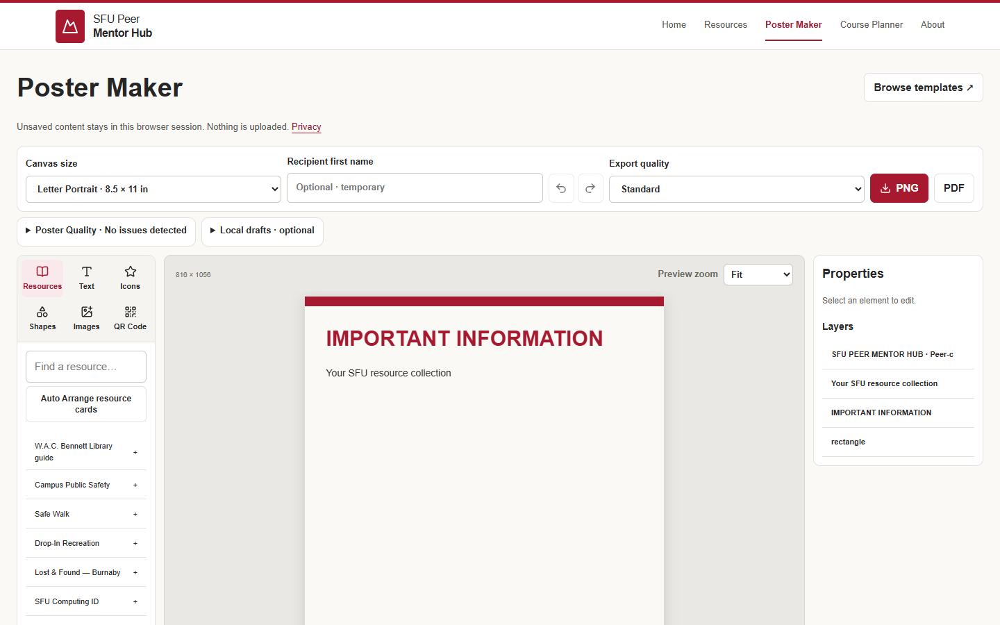

# UI density audit — October 4, 2026

Scope: presentation and copy across the existing application. Course data, importer, normalization, verification, conflict rules, persistence and privacy architecture are unchanged.

## Page review

| Surface | Removed or compressed | Preserved |
| --- | --- | --- |
| Shared navigation | Decorative top strip, duplicate poster CTA, footer slogan; shorter header | Navigation, mobile menu, keyboard focus, independence disclaimer and Privacy & sources link |
| Home | Slogans, illustration panel, repeated module cards and privacy marketing panel | Product name, one functional sentence, three actions, current resources |
| Resources | Page intro, FIND decoration, repeated source explanation; compact cards and unified actions | Search/filters, summaries, deadline and expiration information, verification status, official sources, Copy, Details and Add to Poster |
| Resource details | Compact label/value rows; normal verified metadata no longer styled as a warning; duplicate verification line removed | All facts, actual verification date, unverified/stale notices, source name/link and poster action |
| Poster basket | Promotional copy and large empty placeholder | Count, selected titles, remove, clear and create actions |
| Course results | Giant section badge, repeated course titles and full-size action stack; one aligned filter area | Instructor, full meeting times, campus/delivery, enrollment/waitlist, conflict state, Compare/Poster/Details and both official links |
| Course coverage | Expanded background panel moved to Coverage & sources disclosure | Visible snapshot and changing-data caveat; full coverage counts, missing-data counts and source explanation in disclosure; incomplete coverage opens automatically |
| Course details/comparison | Compact detail fields and warnings; concise empty and no-overlap messages | Prerequisites, description, class number, WQB, source/retrieval metadata, temporary cart, comparison, conflict warning and weekly timetable |
| Poster Maker | Slogan, repeated instructions, oversized margins; collapsed utilities side by side; wider editor area; canvas before tools on phones | Every editor control, quality warnings, exports, local drafts, privacy notice, keyboard help and layer controls |
| Template Gallery | Decorative heading copy; shorter previews and concise replacement notice | All eight templates, descriptions, selection, Undo behavior; preview artwork kept below titles |
| About | Product-philosophy block, slogan, repeated privacy statement and design commentary | Purpose, independent status, source limitations, verification age rules, privacy/storage/export behavior and course snapshot limitations |
| Dialogs/errors/empty states | Shorter empty states and smaller spacing | Keyboard focus restoration, Escape, close buttons, recovery actions and unsaved-data warning |

Poster template content is unchanged. Template-specific welcome language remains inside selected posters, not persistent application copy.

## Measurements

Same device/browser at 1440 × 900, before main `6eda57b` and after this branch. Positions are from the top of the page without scrolling. Course row measurements use the same Fall TEKX snapshot.

| Measurement | Before | After |
| --- | ---: | ---: |
| First Home resource, top | 1,059 px | 394 px |
| First Resource Hub card, top | 578 px | 357 px |
| First TEKX section, top | 1,117 px | 367 px |
| TEKX section row height | 218 px | 67 px |
| Poster canvas, top | 842 px | 427 px |
| Poster canvas on 390 px phone, top | 1,713 px | 714 px |

The default All Subjects view exposes at least five complete section entries in the initial 1440 × 900 viewport. A focused browser test protects this target. Spring TEKX 101 (3D Printing Technologies) and TEKX 110 (Intro to Cyber Skills) render once per course group, with both meeting blocks retained for TEKX 110. The published subject has two offerings; no extra courses were fabricated for the benchmark.

## Validation

- 143 unit/integration tests pass; lint and production build pass.
- All 23 existing browser tests remain; only legitimate visible label changes were updated. Three new tests cover desktop density/grouping/actions, above-fold content and mobile touch targets.
- Browser accessibility/no-overflow checks cover all six routes at 375, 390, 768, 1024 and 1440 px.
- Screenshots of Home, Resources, Courses and Poster Maker were manually inspected at 390, 768, 1024 and 1440 px. Resource/course dialogs, populated basket, comparison, About and Template Gallery were also inspected.
- Course row buttons and links retain 44 px mobile targets. Desktop rows become stacked groups on phones; factual text is not clipped or truncated.
- Existing tests continue to exercise PNG/PDF/QR export, local-draft privacy, temporary recipients, conflicts, keyboard controls, dialogs and missing/offline data recovery.

## Before / after

### Home

### Course results — same Fall TEKX selection

### All Subjects

### Poster Maker

